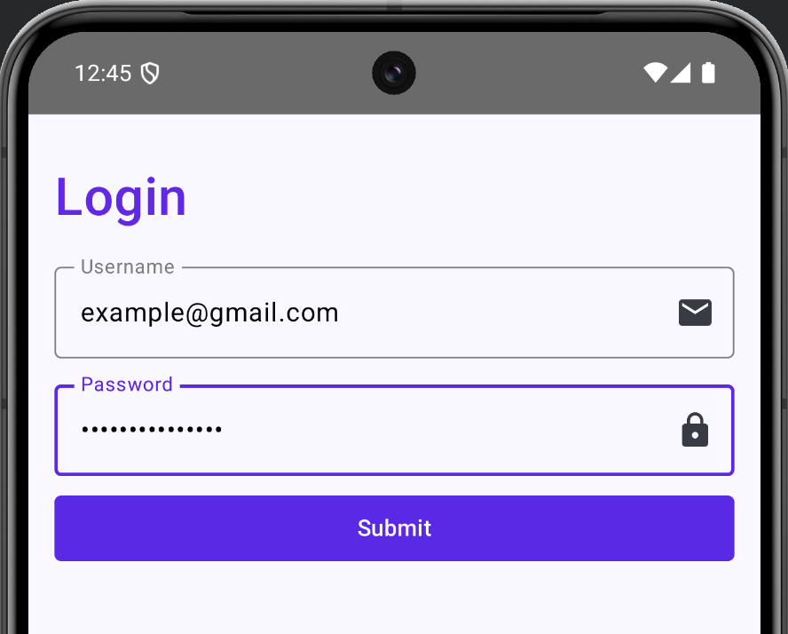

# Login form

Task for this exercise is to create a login form.
There is no functionality and only UI is implemented, and app is not actually validating/executing login (i.e., nothing happens if you press Submit button).

## Implemented UI

